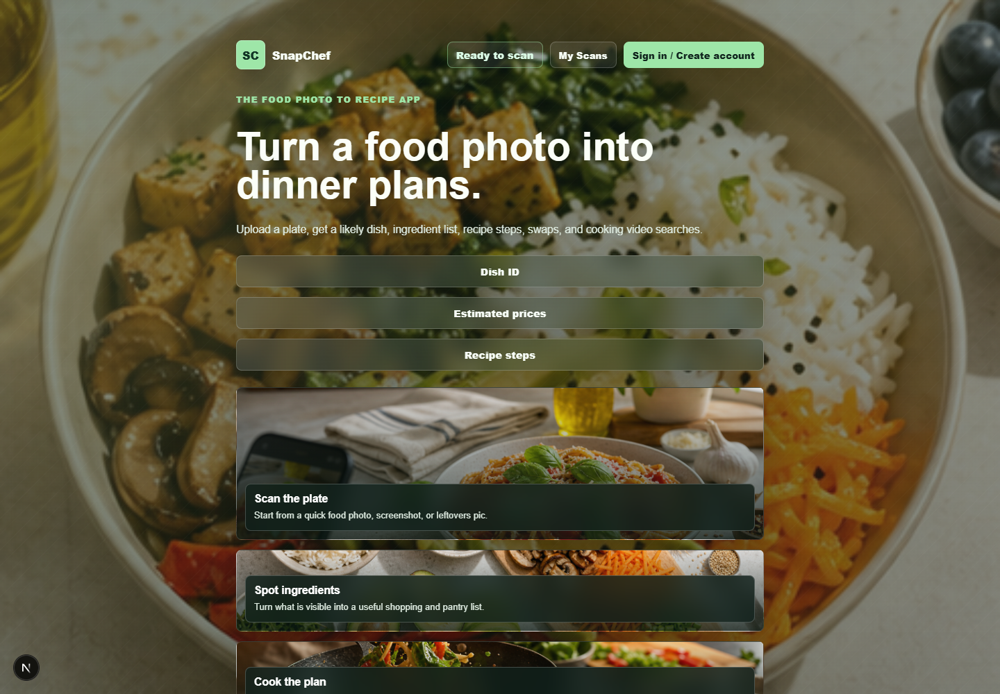

# SnapChef

**[Open SnapChef](https://snapchef-nine.vercel.app/)** · [Portfolio](https://fidel-portfolio-eta.vercel.app/#snapchef)

Turn a food photo into a likely dish, ingredient list, recipe steps, substitutions, rough shopping costs, nutrition estimates, and cooking-video searches. Optional accounts let you save and reopen recipes.



## Try it

1. Upload a JPG, PNG, or WebP image up to 3 MB.
2. Choose servings and preferences; optionally add equipment, dietary notes, and a grocery region.
3. Analyze the image, then review the dish, ingredients, and safety notes before using the plan.
4. Sign in to save the result. **My Scans** reopens the ten most recent saved recipes; you can also delete them.

**See example** loads a fixed pasta recipe and makes no AI request. It is labeled **Example result** and cannot be saved as an analyzed scan. If no AI key is configured on an installation, the API returns a separate fixed recipe with a notice that the uploaded photo was not analyzed. Provider outages and quota failures show an error instead of silently substituting an example.

## Local setup

Use Node.js **22.12 or newer** and npm. CI uses Node 22.

```sh
git clone https://github.com/Fidel2197/SnapChef.git
cd SnapChef
npm ci
```

Copy `.env.example` to `.env.local` (`cp .env.example .env.local` on macOS/Linux, or `Copy-Item .env.example .env.local` in PowerShell). Fill in the settings below, then start:

```sh
npm run dev
```

Open [localhost:3000](http://localhost:3000). Restart the development server after changing environment variables. You can inspect the interface and fixed example without external accounts; actual photo analysis requires an AI provider, and accounts/history require Supabase.

### AI configuration

Choose one provider. Its key stays on the Next.js server; never prefix an AI key with `NEXT_PUBLIC_` or commit `.env.local`.

| Setting | Purpose |
| --- | --- |
| `AI_PROVIDER` | `gemini` (default) or `openai` |
| `GEMINI_API_KEY` | Gemini API key with access to the selected model |
| `GEMINI_MODEL` | Default: `gemini-2.5-flash`; override for a model available to your account |
| `OPENAI_API_KEY` | OpenAI API key, used for the OpenAI option |
| `OPENAI_MODEL` | Default: `gpt-5.5`; override for a vision-capable model available to your account |

The selected provider is preferred when its key is present. If that key is absent, the route uses an available Gemini key, then an available OpenAI key. It does **not** switch providers after a failed request. Requests can consume the provider's quota or incur charges; an API account and model access are separate from consumer chat subscriptions.

### Supabase accounts and saved history

1. Create a Supabase project and run [`supabase/schema.sql`](supabase/schema.sql) in its SQL Editor. The script creates the `snapchef_scans` table, owner-based row-level security, and the `snapchef-scans` image bucket. It can be rerun to recreate the named policies.
2. Enable email/password sign-in in **Authentication → Providers**. Configure email confirmation and email delivery for your intended environment.
3. In **Authentication → URL Configuration**, add `http://localhost:3000/` to allowed redirect URLs for development. For production, set the Site URL and allowed redirect to your deployed app URL, such as `https://snapchef-nine.vercel.app/`.
4. Add `NEXT_PUBLIC_SUPABASE_URL` and `NEXT_PUBLIC_SUPABASE_PUBLISHABLE_KEY` to `.env.local`. A legacy `NEXT_PUBLIC_SUPABASE_ANON_KEY` is also supported; use one key format. The browser uses this public key with the signed-in user's session and database policies. A service-role key is not needed by this app.
5. Restart, create an account, follow the confirmation email if enabled, then sign in. Analyze a photo, select **Save Recipe**, refresh, and reopen it from **My Scans**.

**Storage privacy:** recipe rows are scoped to their owner by RLS. The supplied image bucket is **public**: anyone with a saved photo's URL can view it, even though upload/delete permissions are scoped to the owner. Do not upload private or sensitive photos. Making it private requires coordinated policy and signed-URL code changes; this repository does not claim private image storage.

## How the app is organized

| Area | Responsibility |
| --- | --- |
| `src/components/snapchef-app.tsx` | Connects scan state, page sections, and recipe actions |
| `src/components/snapchef/upload-panel.tsx` | Upload, servings, preferences, and error feedback |
| `src/components/snapchef/results-panel.tsx` and `result-views.tsx` | Result navigation, recipes, shopping, nutrition, and exports |
| `src/components/snapchef/account-panel.tsx` and `history-view.tsx` | Account controls and saved-recipe views |
| `src/components/snapchef/use-account-history.ts` | Authentication lifecycle and history state; discards stale loads after account changes |
| `src/lib/analyze-image.ts` | Shared upload rules and client request/error handling |
| `src/lib/scan-history.ts` | Owner-scoped database queries and image persistence |
| `src/lib/recipe-result.ts` | Backward-compatible result defaults, search links, and export formatting |
| `src/app/api/analyze/route.ts` | Server-side provider calls, result normalization, and fallback labeling |

The stack is Next.js App Router, React, TypeScript, CSS Modules, Supabase Auth/PostgreSQL/Storage, and Gemini or OpenAI. CSS and the established page design are preserved while responsibilities live in smaller components and services.

### Where data goes

- The selected file gets a temporary browser preview. Analysis sends the image, servings, notes, and grocery region to `/api/analyze`, which forwards them to the configured AI provider.
- Saving a scan uploads its photo to Supabase Storage and writes the recipe JSON to the signed-in owner's database row. Saving can succeed without a photo if image upload fails; the interface says so.
- If a recipe insert fails after an image upload, the app attempts to remove that uploaded image. Deleting a saved scan removes its recipe row and then its stored photo; these two operations are not an atomic transaction.
- The grocery region is stored in browser `localStorage`. Supabase manages the browser's authentication session. Unsaved results and shopping checkboxes are temporary page state.

## Checks

```sh
npm run lint
npm test
npm run build
npm start
```

`npm run test:watch` is available while developing. [GitHub Actions](https://github.com/Fidel2197/SnapChef/actions) runs lint, tests, and a production build on pushes to `main` and pull requests.

Tests cover rejected/oversized/empty uploads, request payloads, API/network/provider failures, explicit example fallback, retry feedback, saving/loading/deleting recipe history, failed-upload cleanup, and stale history arriving after sign-out. They use mocked AI and Supabase boundaries, so they require no keys and incur no provider cost. They do not replace checking the deployed Supabase policies or a real provider/account flow.

## Deploying to Vercel

Import this repository as a Next.js project. Configure the AI and Supabase variables above in Vercel for the intended environment, deploy, and add the resulting URL to Supabase's auth redirect allowlist. `NEXT_PUBLIC_*` values are included at build time, so redeploy after changing them. Keep AI keys in Vercel's environment settings.

The API uses the Node.js runtime and allows up to 60 seconds; each upstream AI call times out after 45 seconds. The shared 3 MB image limit leaves room for multipart overhead within the hosting request limit. Verify an actual scan plus sign-in/save/reopen/delete after configuring a new installation.

## Known limitations

- A photo cannot reveal every ingredient or allergen. Dish names, nutrition, prices, and portions are estimates; check labels and quantities yourself. Grocery prices and store suggestions are generated, not live inventory lookups.
- Video links open YouTube search results, not curated or verified tutorials.
- The interface shows the ten latest saved scans; it has no history pagination or editing of an existing saved record. Saving an edited dish creates another record.
- Uploaded images use the public bucket described above. Network failures during deletion or cleanup can leave a storage object behind.
- Image checks validate declared format and size, not a full image decode. The AI provider may still reject corrupt image bytes.
- The public analysis route has no application-level per-user rate limit. Use provider quotas and deployment controls before exposing an installation to substantial traffic.
- Automated checks mock external services. Real provider availability, email delivery, RLS enforcement, and deployed account flows still need environment-specific validation.

## Development notes

This project was developed with AI-assisted implementation. The repository exposes the design choices, limitations, source changes, and repeatable checks so the work can be reviewed. The latest maintenance pass split the large component, added regression tests, corrected the hosting upload limit, and made failure states explicit.
